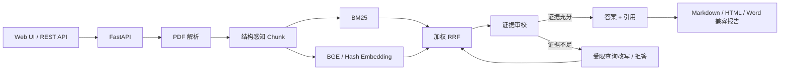

# EvidenceRAG

EvidenceRAG 是一个以证据可追溯为核心的个人学术 PDF 问答项目，将文档解析、混合检索、证据审校、引用回链和报告导出串联为统一工作流。

> 公开展示仓库：本仓库仅包含经过筛选的检索代码、测试、架构说明、聚合 Benchmark 结果和 Demo 证据。完整应用、私有评测数据、模型文件及未公开研究材料不对外发布。

## 核心能力

- 上传并解析学术 PDF，生成带页码信息的 Chunk。
- 通过可配置的加权 RRF 融合 BM25 与 BGE 检索结果。
- 回答前审校证据，在证据不足时允许拒答。
- 将答案引用回链到原始 Chunk 和页码。
- 导出 Markdown、HTML 和 Word 兼容报告。

## 已验证结果

正式检索评测采用 SciFact 官方证据标注，覆盖 1,000 篇论文摘要、8,718 个句子级 Chunk 和 300 条 Claim。

| 路线 | Recall@5 | MRR@5 | nDCG@5 |
|---|---:|---:|---:|
| BM25 | 0.5930 | 0.5562 | 0.5156 |
| BGE-small-en-v1.5 | **0.7355** | **0.6503** | **0.6271** |
| 等权 RRF | 0.7038 | 0.6390 | 0.6020 |
| RRF + 启发式重排 | 0.5624 | 0.5376 | 0.4907 |

相较 BM25，BGE 的 Recall@5 提升 24.03%，MRR@5 提升 16.92%。等权 RRF 和启发式重排均未超过 BGE，因此本仓库不将其描述为已验证提升。详见 [Benchmark](docs/BENCHMARK.md)。

完整论文结构化文本评测采用 QASPER 官方证据标注，固定覆盖 100 篇论文、100 条 Query 和 4,830 个段落 Chunk。BM25、BGE、加权 RRF 的 Recall@5 分别为 0.4831、0.5879、0.6029。加权 RRF 仅在点估计上略高于 BGE，尚未做显著性检验。该评测不等同于 PDF 解析或答案生成评测，详见 [Benchmark](docs/BENCHMARK.md) 和[机器可读摘要](artifacts/qasper_benchmark_summary.json)。

## 架构



组件边界详见 [架构说明](docs/ARCHITECTURE.md)。

## 公开代码与测试

公开实现覆盖项目实际使用的词法切分和加权 RRF 行为，代码保持精简并可独立测试。

```bash
python -m pip install -r requirements.txt
python -m unittest discover -s tests -v
```

## Demo


该中文本地运行使用双语合成文档，展示了完整答案、Planner、Reviewer、两条证据及页码引用锚点。英文运行见 [English demo](docs/DEMO.md)。中文验收流程、证据边界和[脱敏机器可读结果](artifacts/sample_query_response.zh-CN.json)详见[中文 Demo 说明](docs/DEMO.zh-CN.md)。

## 仓库结构

```text
.
├── src/evidencerag/       # 精选检索实现
├── tests/                 # 可运行的 unittest 测试
├── docs/                  # 架构、Benchmark 与 Demo 文档
├── assets/                # 真实本地运行截图
├── artifacts/             # 脱敏机器可读 Demo 证据
├── .github/workflows/     # 公开测试工作流
├── requirements.txt
└── NOTICE.md              # 披露与使用边界
```

## 公开边界

不包含：API Key、原始论文、解析后的私人文档、向量索引、模型权重、完整应用服务、未公开研究代码、私有逐 Query 分析或本地运行数据。上述材料不通过本公开仓库分发。
