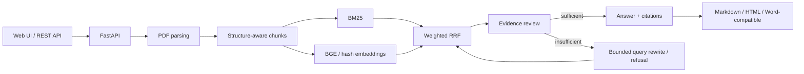

# EvidenceRAG

EvidenceRAG is a personal academic-PDF question-answering project focused on traceable evidence. It connects document parsing, hybrid retrieval, evidence review, citation backtracking, and report export in one workflow.

> Public showcase: this repository contains selected retrieval code, tests, architecture, aggregate benchmark results, and demo evidence. The complete application, private evaluation assets, model files, and unpublished research materials are not publicly released.

## What it does

- Uploads and parses academic PDFs with page-aware chunks.
- Combines BM25 and BGE retrieval through configurable weighted RRF.
- Reviews evidence before answering and permits evidence-insufficient refusal.
- Returns citations that link answers back to source chunks and pages.
- Exports Markdown, HTML, and Word-compatible reports.

## Verified results

The formal retrieval evaluation uses the official SciFact evidence annotations: 1,000 paper abstracts, 8,718 sentence-level chunks, and 300 claims.

| Route | Recall@5 | MRR@5 | nDCG@5 |
|---|---:|---:|---:|
| BM25 | 0.5930 | 0.5562 | 0.5156 |
| BGE-small-en-v1.5 | **0.7355** | **0.6503** | **0.6271** |
| Equal-weight RRF | 0.7038 | 0.6390 | 0.6020 |
| RRF + heuristic reranking | 0.5624 | 0.5376 | 0.4907 |

BGE improved Recall@5 by 24.03% and MRR@5 by 16.92% over BM25. Equal-weight RRF and heuristic reranking did not outperform BGE, so this repository does not claim that they did. See [Benchmark](docs/BENCHMARK.md).

## Architecture



Detailed component boundaries are documented in [Architecture](docs/ARCHITECTURE.md).

## Public code and tests

The selected public implementation covers the actual lexical tokenization and weighted-RRF behavior used by the project. It is intentionally small and independently testable.

```bash
python -m pip install -r requirements.txt
python -m unittest discover -s tests -v
```

## Demo


The two-minute verification path and evidence boundaries are documented in [Demo](docs/DEMO.md).

## Repository layout

```text
.
├── src/evidencerag/       # selected retrieval implementation
├── tests/                 # runnable unittest checks
├── docs/                  # architecture, benchmark, and demo
├── assets/                # real local-run screenshot
├── .github/workflows/     # public test workflow
├── requirements.txt
└── NOTICE.md              # disclosure and usage boundary
```

## Disclosure boundary

Not included: API keys, raw papers, parsed private documents, vector indexes, model weights, complete application services, unpublished research code, per-query private analyses, or local runtime data. A full running version and detailed evaluation artifacts can be demonstrated during interviews.
