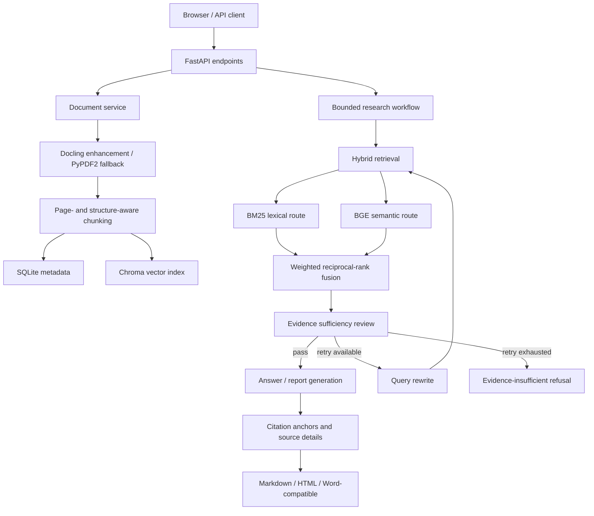

# Architecture

## Main workflow

## Design decisions

| Decision | Reason | Boundary |
|---|---|---|
| Rank-based fusion | BM25 and vector scores are not directly comparable | Fusion weights must be selected on training data |
| Parser fallback | A demo should survive missing Docling assets | PyPDF2 does not provide the same structure quality |
| Bounded rewrite | Prevents an unbounded agent loop | Evidence insufficiency can still end in refusal |
| Citation details | Makes generated claims traceable to source chunks | Citation presence alone does not prove claim correctness |
| Local fallback | Allows offline workflow verification | Hash embeddings are not reported as BGE quality |

## Public/private boundary

The public `src/` directory is a selected, runnable extraction of lexical retrieval and weighted RRF. The complete API, persistence, Agent workflow, model integration, and private assets remain private. The diagram describes the verified full local system, not the scope of the public code package.
