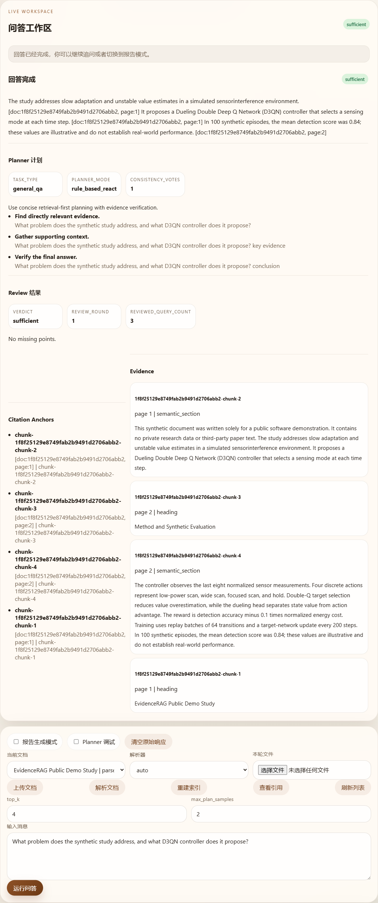

# Demo

[English](DEMO.md) | [简体中文](DEMO.zh-CN.md)

## Two-minute verification path

1. Upload a permitted sample PDF.
2. Parse it into page-aware chunks and build the index.
3. Ask a question whose answer is present in the document.
4. Inspect the retrieved evidence and citation details.
5. Open the cited source chunk/page.
6. Export the result as Markdown, HTML, and Word-compatible output.

## Recorded completed query

Question: `What problem does the synthetic study address, and what D3QN controller does it propose?`

Answer summary: The study addresses slow adaptation and unstable value estimates in simulated sensor interference. It proposes a D3QN controller that selects a sensing mode at each time step.

The screenshot is from the fixed offline route using a four-page bilingual synthetic document written for this public demonstration. It shows a completed English answer, a `sufficient` review verdict, four evidence items, and four page-aware citation anchors. A sanitized response summary is available as [`artifacts/sample_query_response.json`](../artifacts/sample_query_response.json). The [Chinese query and answer](DEMO.zh-CN.md) use the same source document. No private research data or third-party paper text is used in either public example.

The empty-state interface is retained separately for visual reference:

## Verified local behavior

Separately, the full isolated workflow replay was executed three consecutive times. Each round processed the same five-page permitted sample, produced 36 chunks, returned five evidence/citation items, resolved citation details, and exported all three report formats.

This verifies repeatability of the selected local workflow on one machine and sample. It is not a production-concurrency, cross-dataset, or enhanced-model quality claim.
