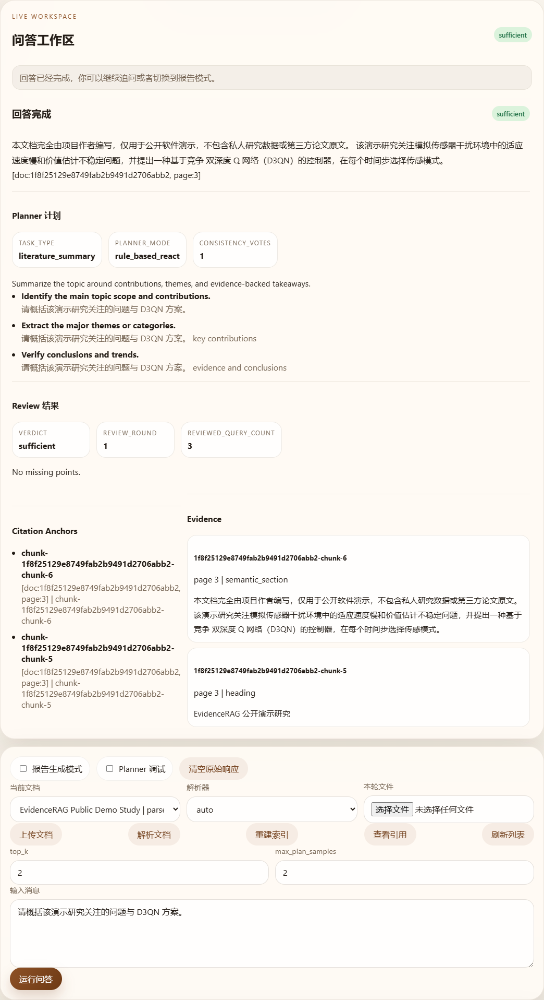
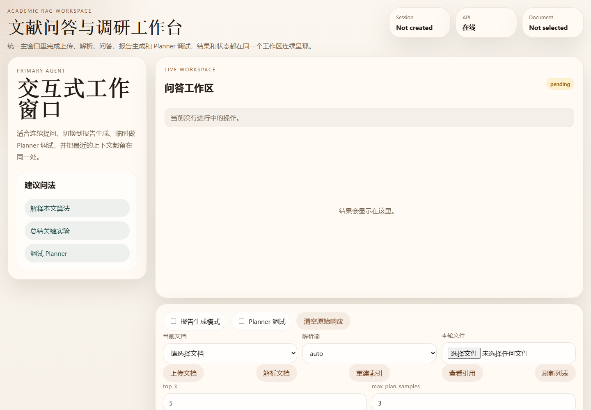

# Demo

[English](DEMO.md) | [简体中文](DEMO.zh-CN.md)

## 两分钟验收流程

1. 上传一份允许使用的样例 PDF。
2. 解析为带页码信息的 Chunk 并建立索引。
3. 提出一个可由文档内容回答的问题。
4. 检查召回证据和引用详情。
5. 打开引用对应的原始 Chunk/页码。
6. 将结果导出为 Markdown、HTML 和 Word 兼容格式。

## 已记录的中文问答

问题：`请概括该演示研究关注的问题与 D3QN 方案。`

回答摘要：该合成研究关注模拟传感器干扰环境中的适应速度慢和价值估计不稳定问题，并提出一种基于竞争双深度 Q 网络（D3QN）的控制器，在每个时间步选择传感模式。

截图来自固定离线路线，使用专门为公开演示编写的四页双语合成文档。运行结果包含完整中文答案、`sufficient` 审校结论、两条证据和两个页码引用锚点。脱敏结果见 [`artifacts/sample_query_response.zh-CN.json`](../artifacts/sample_query_response.zh-CN.json)，同一文档的[英文问答见此](DEMO.md)。两个公开示例均不包含私人研究数据或第三方论文原文。

空白工作台界面保留用于视觉参考：

## 已验证的本地行为

除上述公开合成示例外，完整隔离工作流还连续执行了三轮回放。每轮均处理同一份允许使用的五页样例，生成 36 个 Chunk，返回五条证据与引用，成功解析引用详情，并导出三种报告格式。

该结果只证明指定机器和样例上的工作流可重复性，不代表生产并发能力、跨数据集泛化能力或增强模型质量。
